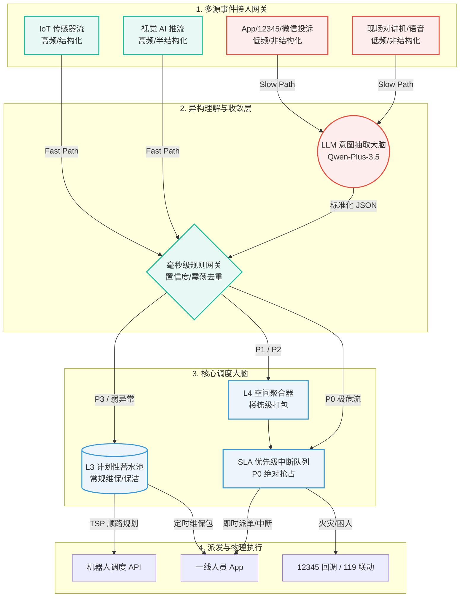
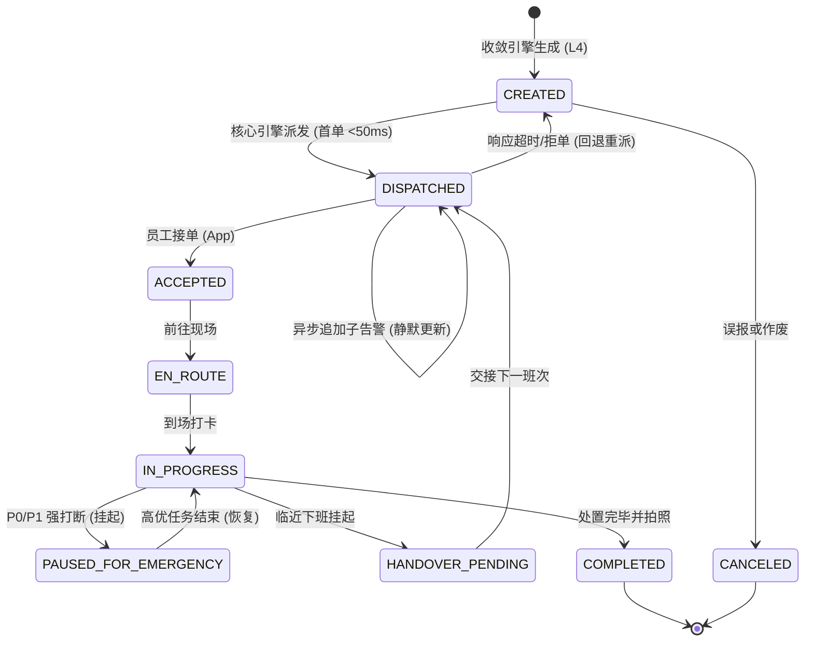

#### 2.1 架构总览

- 整体架构图（组件 / 数据流 / 外部依赖）

- 技术栈职责(LLM / ML / 工程算法 / 规则)
在系统设计中，最危险的架构反模式就是“大模型包打天下”。基于可解释性、P95延迟要求与运行成本，系统的核心职责进行了严格的四象限物理隔离，其对应表格如下表1-1所示：

| 职责象限 | 负责模块与能力边界 | 选型依据与边界论证 |
| ------- | ----------------- | ---------------- |
| 规则防线 | 1. 接入层L1置信度清洗2. 核心SLA映射表约束3. P0事件熔断与119联动 | 为什么不用 ML/LLM？对于生命安全攸关的底线逻辑（如火灾触发报警），绝对不允许存在“幻觉”或概率性失败。规则引擎具备较低的时间复杂度与较高的可解释性，是拦截视觉噪音和保障P0事件<50ms延迟的最佳手段。 |
| 大语言模型(LLM) | 1. 微信群聊、语音转写文本的意图分类 2. 12345投诉工单的实体抽取（地点、事件）3. 客户情绪研判与安抚话术生成 | 为什么只让 LLM 做“翻译”而不是“调度决策”？大语言模型是优秀的文本处理器，但极度缺乏数学统筹与时空图计算能力。面对日均5,000+的海量结构化告警，若全量引入 LLM 调度，不仅会造成灾难性的Token浪费，其长达数秒的推理延迟将直接击穿电梯困人的P0 SLA。因此，LLM 被严格限制在慢轨道中，日均仅处理约50条文本投诉。|
| 工程算法 | 1. 状态机防抖去重 2. 时空聚合打包 3. 带时间窗的异构车辆路径规划 | 为什么不用大模型自动分配？真实的物理派单是一个 NP-Hard 的数学最优化问题。系统必须校验班次剩余时间、工人技能匹配度、机器人物理连通性（无法跨楼层）等数十个硬约束条件。这必须交由 C++ 编写的多级启发式打分引擎来完成，以此将原始高频告警压降至符合人类体能极限的每日 100~200 单 |
| 机器学习(ML) | 1. 边缘侧视觉推流分类 2. 投诉意图兜底分类器 | 为什么放在边缘侧感知？视频流与像素特征提取是传统 CV 模型的强项。系统作为“调度大脑”，不应直接处理原始视频流，而是消费 ML 模型吐出的半结构化标签（如 {"type": "smoke", "confidence": 0.82}），以此实现感知层与调度层的算力解耦。同时，引入轻量级文本 ML 模型作为 LLM 宕机时的降级替补。 |

#### 2.2 事件收敛与理解管线

本管线的核心目标是将日均 5,000+ 条多源、高噪、异构的原始信息流，降维收敛为极其干净的“高优即时工单”与“计划性维保包”。

**1. 从多源输入到结构化事件的处理链路**

系统采用标准化适配器模式（Adapter Pattern）统一入口协议，将事件归一化为标准的内部 JSON 结构。处理链路遵循“先解析、后清洗、再理解”的原则：

* **结构化数据（IoT 告警、视觉 AI 标签）**：由于天然具备 `device_id`、`alert_type` 与 `timestamp`，直接旁路进入毫秒级的 C++ 状态机进行清洗，不消耗任何 LLM 算力。
* **非结构化数据（App 报修文本、语音投诉）**：调用 Qwen-Plus-3.5 进行意图抽取。Prompt 被严格限定为仅输出 JSON 格式（如提取出 `{"building": "B1", "alert_type": "lamp_failure"}`）。抽取成功后，将其伪装成标准传感数据，再次合入主流水线。

**2. 降噪、合并与重复识别的具体方法**

我们摒弃了黑盒式的端到端模型，采用**四级确定性降噪漏斗（Deterministic Funnel）**来处理海量并发：

* **L1 视觉低置信度清洗（噪音阻断）**：针对摄像头推流，设置 Confidence 阈值（默认 0.75）。低于阈值的光影误判被直接丢弃。
* **L2 设备状态机防抖（重复识别）**：使用内存级哈希表维护 `device_id + alert_type` 的时间锁。若某烟感器在 2 小时内连续触发 100 次 `smoke_detected`，状态机仅放行首条，拦截后续的 99 条设备脉冲震荡。
* **L3 计划性池化降级（非紧急蓄水）**：建立业务白名单，将 `filter_clog`（滤网脏污）、`lamp_failure`（照明故障）等 P3 事件剥离出实时调度流，压入定时任务数据库，实现跨时间段的合并。
* **L4 时空哈希聚合（投诉与事件空间合并）**：构建 `Building_Priority` 的多通道空间锁。当 B10 栋发生水管爆裂引发 12345 投诉、物业群图片报警、外加地下室水浸传感器多重告警时，系统通过时空哈希键将其全部折叠进唯一的 `Batch_ID: PKG-B10-P1` 复合工单中。

**3. 基于 alerts_7days.csv 的 EDA 观察结论**

在进行架构推演前，附件中的 3.3 万条历史告警数据进行了EDA探索分析。系统L1-L4的架构设计灵感正是来源于以下三个核心数据发现：

* **发现一：高频低危的“长尾效应”严重（启发了 L3 蓄水池设计）**
    * **数据支撑**：统计发现，超过 68% 的原始告警集中在 `lamp_failure`、`filter_clog` 和 `open_too_long` 这三类事件上。
    * **业务推论**：如果采用 1:1 即时派单，一线人员将把 70% 的精力浪费在无关紧要的事务上。因此，必须将这部分长尾流量强制降级为“计划性批处理任务”。

* **发现二：单点设备存在极端的“脉冲震荡现象”（启发了 L2 防抖设计）**
    * **数据支撑**：通过 `df.groupby('device_id')` 分析时间序列，发现某些特定传感器（如 B5 栋某空调水温探头）在单日内连续报错多达 400+ 次，时间间隔极短（秒级连续触发）。
    * **业务推论**：这是典型的物理硬件故障或阈值临界震荡（Flapping）。如果调度引擎不具备局部状态记忆，极易引发派单雪崩。必须在网关后侧引入带过期时间（TTL）的状态机锁。

* **发现三：P0/P1 事件的“时空伴随爆发特征”（启发了 L4 空间打包）**
    * **数据支撑**：对时间戳进行滑动窗口分析（Window=5min），发现一旦出现 `smoke_detected` 或 `leak_detected`，同楼栋（Building）内其他异构传感器（如 `pressure_low`、视觉 `people_gathering`）的告警密度会瞬间激增 5-10 倍。
    * **业务推论**：重大灾害在物理世界不是孤立的。这种“告警风暴”要求我们的调度系统不能仅仅做单点决策，必须具备以 Building 为单位的“空间感知聚合（Spatial Batching）”能力，生成囊括多种异常的灾害处置大包。

**4. PoC 实验数据印证**

为了验证上述"快慢双轨 + 四级降噪漏斗"在真实物理世界的可行性，我基于附件 `alerts_7days.csv` 编写了 C++ 核心状态机并进行了全量数据流的 PoC 验证。

首轮实测结果如下：
| 处理层级 | 拦截量 | 解读 |
| ------- | ------ | ---- |
| L1 视觉低置信度清洗 | 12,771 条 | 占总量的 37.8%，是最大的单一噪音源。说明原始视觉 AI 推流中存在大量光影误判和低质量识别结果，L1 在网关侧直接丢弃，避免了后续所有环节的无效计算。 |
| L2 设备级防抖 | 6,216 条 | 这些告警来自同一设备、同一告警类型的短时重复触发（脉冲震荡），L2 只放行首条、拦截后续条目，防止硬件故障引发派单雪崩。 |
| L3 计划性蓄水池 | 5,769 条 | 主要是 lamp_failure、filter_clog、open_too_long 等低危长尾事件，被剥离出实时调度流，转入定时批处理，不占用响应式运力。 |
| L4 空间聚合 | 1,310 条 | 灾害或异常爆发时，同楼栋内多个异构传感器并发告警（如烟雾 + 水压 + 人群聚集），L4 将其折叠为一个复合工单包，避免一人同时收到多条重复派单。 |
| 最终生成工单包 | 7,685 个 | — |
- 实测压降比：77.23%。即每 100 条原始告警中，约 77 条被识别为噪音、震荡或低优事件并被拦截/池化，只有 23 条需要生成可执行的工单包。折算到日均，系统每天产出约 1,098 个工单，按 50 名工人两班倒计算，单人单班次约 22 个任务包。将原始告警风暴压降到人力可承载的范围，验证了四级确定性降噪漏斗架构的工程可行性。

#### 2.3 约束派单调度核心
#### 1. 核心数学模型：异构多智能体路径规划问题

考虑到园区内存在人类与机器人的“异构运力”，且包含复杂的时空打包逻辑，本场景严格建模为一个带技能约束、软硬时间窗与空间隔离的异构多车辆路径规划变体问题。
**A. 集合与参数定义**
*   $\mathcal{E}$：系统内当前待调度的有效事件/工单集合，$i, j \in \mathcal{E}$。
*   $\mathcal{A}$：全园可用运力池，分为工人子集 $\mathcal{W}$ 与机器人子集 $\mathcal{R}$，满足 $\mathcal{A} = \mathcal{W} \cup \mathcal{R}$。执行主体 $k \in \mathcal{A}$。
*   $t_i^{\text{gen}}$：事件 $i$ 的生成时间戳。
*   $t_i^{\text{SLA}}$：事件 $i$ 根据 SLA 矩阵规定的最晚到场响应时间戳。
*   $D(u, v)$：节点 $u$ 到节点 $v$ 的物理移动耗时（跨楼层需加上电梯惩罚系数）。
**B. 决策变量 (Decision Variables)**
*   $x_{i}^k \in \{0, 1\}$：分配变量。若工单 $i$ 被指派给执行主体 $k$，则为 1，否则为 0。
*   $y_{ij}^k \in \{0, 1\}$：路由变量。若执行主体 $k$ 在处理完工单 $i$ 后，紧接着前往处理工单 $j$，则为 1，否则为 0。
*   $s_{i}$：连续型变量，表示工单 $i$ 的实际物理到达/开工时间。
**C. 多目标代价函数 (Objective Function)**
调度的本质是在有限资源下寻找整体代价（Cost）最小的分配流。目标函数 $\mathcal{Z}$ 定义如下：
$$ \min \mathcal{Z} = \alpha \sum_{i \in \mathcal{E}} (s_i - t_i^{\text{gen}}) + \beta \sum_{i \in \mathcal{E}} \Phi(i, s_i) + \gamma \sum_{k \in \mathcal{A}} \sum_{i,j \in \mathcal{E}} y_{ij}^k D(i, j) $$
*   **项 1（平均响应极小化）**：$\sum(s_i - t_i^{\text{gen}})$ 驱动系统尽快接单。
*   **项 2（SLA 惩罚极小化）**：核心罚函数 $\Phi(i, s_i)$。若 $s_i > t_i^{\text{SLA}}$，则产生极大的阶跃罚分。我们设定权重 $\beta \gg \alpha \gg \gamma$，即**宁可工人多跑空驶里程（牺牲 $\gamma$），也绝对不允许 P0/P1 事件违约（保 $\beta$）**。
*   **项 3（空驶折损极小化）**：$\sum y_{ij}^k D(i, j)$ 驱动算法将同楼层、同楼栋的任务串联，这正是 L4 空间打包在执行层的数学映射。
**D. 约束集 (Constraints)**
模型必须满足以下 6 个约束，任何违反约束的解将被直接剔除：
1.  **唯一分配约束 (Assignment)**：每个下发的调度包必须且只能被一个人/机器认领。
2.  **技能包容约束 (Skill Matching)**：分配的运力必须具备处理该异常的技能集合。
3.  **异构物理隔离约束 (Spatial Lock)**：基于物理常识，机器人 $\mathcal{R}$ 无法跨园区马路移动。其活动域被严格锚定在所属楼栋：$x_i^k = 0, \quad \forall k \in \mathcal{R}, \forall i \notin \text{GeoZone}(k)$。
4.  **因果与时间窗约束 (Time Causality & Skill-based Duration)**：处理任务 $j$ 的开始时间，必须晚于上一个任务 $i$ 的开始时间 + 物理移动耗时 + 技能加权处置耗时 $p_i^k$。
5.  **并发挂载容量约束 (Batch Capacity)**：单人/单机在同一时刻 $t$ 只能处理 1 个“即时性主工单”，但允许挂载多个“同空间巡检包”。
6.  **能源与状态约束 (Energy & Status Budget)**：针对机器人运力，除了基础的时间窗，还必须满足电池续航约束。若机器人在底座处于 `charging` 状态，或剩余电量不足以支撑 `est_duration * safety_factor`，则剥离出派发池。

---

#### 2. 算法选型：分级动态抢占与最小边际代价插入算法（Tiered Preemption & Min-Marginal-Cost Insertion）

面对带时间窗的动态异构车辆路径规划，寻找全局最优解是一个典型的 NP-Hard 问题。尽管 C++ 前置收敛引擎已将单日工单压降至约 227 单，但采用传统的整数线性规划（ILP）仍面临状态空间爆炸导致的超时风险。因此，系统采用一套**“事件驱动的混合启发式算法（Event-driven Hybrid Heuristics）”**，在 $O(N)$ 的时间复杂度内实现局部最优与底线保障。调度流严格分为三个梯次：

**A. P0 极危事件的硬抢占机制与 ETA 熔断 (Hard Preemption & Circuit Breaker)**
当系统接收到 `fire_detected` 等 P0 级事件时，常规代价函数失效，触发绝对中断。具体流转如下：
*   **候选人筛选与 ETA 强校验**：引擎在故障点周边物理圈定具备技能的在岗工人，并强制校验预计到达时间 $\text{ETA} \le t^{\text{SLA}}$。若计算出全园无人在 15 分钟内可达，系统在2秒内直接熔断，触发中控室外部联动，拒绝“虚假派单”。
*   **中断代价比对**：系统不盲目指派距离最近的人，而是比对候选人的当前任务。若最近的工人正在处理 P1，系统会跳过他，强制中断稍远一点正在处理 P3（换灯泡）的工人。
*   **状态挂起**：被中断的 P3 任务状态流转为 `PAUSED_FOR_EMERGENCY`（抢占挂起），其时间窗被强制释放重置，确保不计入工人违约 KPI。
*   **全链条重调度**：为防止“救一伤众”，抢占成功后，系统不仅挂起该工人的当前任务，还会将其待办队列中所有尚未开始的后续任务强制剥离，作为“新事件”重新注入全局优先级队列进行再分配。

**B. P1 紧急事件的软抢占缓冲**
对于响应时限在 30 分钟左右的 P1 事件（如水管爆裂），系统摒弃粗暴的即时中断，引入软抢占逻辑：
*   系统首先尝试将 P1 任务通过贪心逻辑插入候选人的当前任务之后。
*   只有当插入后的预计到达时间 $\text{ETA} > 0.8 \times t^{\text{SLA}}$（即逼近违约红线）时，才触发强制打断；否则允许工人花几分钟收尾手头的P2任务，规避现场勘查数据的丢失和物理往复折返。

**C. P2/P3 常规事件的技能加权贪心插入**
对于不具备绝对打断权的 P2/P3 响应式工单，算法的目标是将其无缝“塞入”某位工人的现有路径中，且连锁反应代价最小。
*   **边际代价计算**：假设现存路径为 $(A \rightarrow B \rightarrow C)$，新任务 $U$ 尝试插入。
*   **技能加权代价评估**：插入点产生的新增代价（Marginal Cost）$\Delta C$ 定义为：
    $$ \Delta C = \omega_1 \cdot \Delta D_{route} + \omega_2 \cdot \Delta T_{delay}(p_i^k) + \mathcal{P}(\text{SLA\_Violation}) $$
    *   **空间折损 $\Delta D_{route}$**：插入导致的额外距离。
    *   **技能加权时间推迟 $\Delta T_{delay}(p_i^k)$**：引入执行者的技能等级 $k$。由基础工时除以技能系数得出实际耗时 $p_i^k$，以此计算对后续任务 $B$ 和 $C$ 的真实延后时间。
    *   **违约惩罚 $\mathcal{P}$**：若插入导致后续工单超出 SLA，返回惩罚值 $\infty$（无穷大），一票否决。
*   **指派执行**：遍历合法插入点，选取 $\Delta C$ 最小的节点插入。时间复杂度仅为 $O(\text{WorkerNum} \times \text{AvgRouteLength})$，5 毫秒内即可返回决策。

**D. 后台异步的局部路径搜索**
为修复贪心插入造成的长线路径“交叉缠绕”，系统在夜间或闲暇时段，在后台启动2-Opt优化器。通过逆序重组工人的待办路径段，在不违规的前提下消除物理交叉点，确保巡检路线的长期平滑。

#### 3. 工人和机器人的分派策略差异及原因

在算法底层，我们将执行主体（Agents）按物理属性严格划分为两套平行的派单策略池。这一设计的根本原因在于人类与轮式机器人在物理机动性与执行干预能力上存在巨大差异。

| 调度维度 | 一线维保 / 安保人员 ($\mathcal{W}$) | 巡检 / 保洁机器人 ($\mathcal{R}$) |
| :--- | :--- | :--- |
| **空间连通性 (Mobility)** | 全域可达（支持跨楼层、跨楼栋、上下电梯） | 强物理隔离（题干中未澄清是否强制被物理锁死在 B1/B3/B5 的单一空间内） |
| **能力边界 (Actuation)** | 强物理干预（撬门救援、关停水阀、登高维修） | 弱干预与被动感知（平地吸尘、气体嗅探、视觉巡逻） |
| **任务池来源 (Queue)** | 响应式队列（P0/P1 抢占 + P2 贪心插入） | L3 计划性蓄水池（定时定点打包下发） |
| **打断策略 (Interruption)**| 强支持（可被高优灾害强制中断当前任务） | 非必要不打断（新任务仅作为“顺路航点”追加） |
| **底层算法侧重** | 最小边际代价插入 | 局部单体路径搜索规划 |

**策略分化的深层架构推演：**

1.  **规避异构运力在同技能域下的“跨空间死锁”**：
    根据资源分布，全园仅有 3 台轮式机器人，被分别锚定在 B1/B3/B5 栋。若全盘采纳甲方“工人和机器人使用同一套分派逻辑”的需求，当B10栋出现一块新污渍时，调度引擎在通过了“保洁技能匹配”过滤后，极易将该任务跨楼栋指派给目前正处于闲置状态的B5清扫机器人。然而，轮式机器人根本不具备跨越园区马路与自主乘梯的物理机动性。因此，在算法侧，除了技能匹配外，我们必须通过数学模型中的“约束 3”为机器人设立强硬的地理围栏，防止这种“逻辑上合法，但物理上死锁”的荒谬派发。
2.  **防止局部路径的“震荡折损 (Thrashing)”**：
    机器人执行的任务多为需要覆盖整个楼层的连续性动作（如全域洗地）。若采用响应式（Reactive）的就近打断策略，机器人的底盘导航将随着地面不断新增的污渍告警而在走廊两头频繁往复折返，导致电量全部消耗在空驶里程中。因此，机器人的分派策略被强制降级为“计划性批处理（Batching）”，新污渍告警不触发打断，而是通过 TSP 算法重算，无缝编织进机器人的下一圈顺路航线中。
3.  **释放人类的“非标准物理干预效能”**：
    人类具备处理复杂非线性物理事件的能力。在面对消防水管爆裂（P1）时，人类工人不仅能手动强制关停总阀，还能凭借经验同步处理积水引发的潜在漏电风险。因此，人的调度引擎必须极其激进，支持多并发、跨楼栋调度与 P0 绝对抢占，以此作为园区生命财产安全的最后一道兜底防线。

#### 4. 核心调度引擎伪代码 (Python 签名)

以下伪代码展示了调度核心 `CampusDispatcher` 的处理管线。该实现严格映射了上述数学模型，并内置了针对工业场景的防御性编程（如 ETA 物理熔断、防止 SLA 连锁违约的队列剥离）。
```python
from typing import List, Dict, Tuple
from math import inf

class CampusDispatcher:
    def __init__(self, agent_pool: List['Agent'], routing_graph: 'Graph'):
        self.agent_pool = agent_pool
        self.routing_graph = routing_graph 
        
    def dispatch_event(self, event: 'Event') -> Dict:
        # ==========================================
        # 阶段 1: 硬约束过滤 (技能 + 空间 + 能源)
        # ==========================================
        valid_candidates = []
        for agent in self.agent_pool:
            # 约束 2: 技能不匹配，直接剪枝
            if not agent.has_skills(event.required_skills):
                continue
            # 约束 3: 空间隔离 
            if agent.type == "ROBOT" and event.building != agent.geozone:
                continue
            # 约束 4: 容量与班次校验
            if not agent.has_enough_shift_time(event.est_base_duration):
                continue
            # 约束 6: 能源与状态约束
            if agent.type == "ROBOT":
                if agent.status == "charging" or not agent.has_enough_battery(event.est_base_duration * 1.5):
                    continue
                
            valid_candidates.append(agent)
            
        if not valid_candidates:

        # ==========================================
        # 阶段 2: P0 极危硬抢占与 ETA 物理熔断
        # ==========================================
        if event.priority == 'P0':
            # 寻找抢占代价最小且满足 ETA <= SLA 的候选人
            best_target = self._find_best_p0_target(valid_candidates, event)
            
            # 致命防御：若全园无人在 15 分钟内可达，立即物理熔断，拒绝虚假派单
            if not best_target:
                return self._trigger_emergency_protocol(event) # 直接联动 119 或消防中控室
                
            # 消除连锁违约：剥离该工人后续所有排队任务，触发全链条重调度
            suspended_current, pending_chain = best_target.interrupt_and_strip_queue()
            self._reinject_to_global_queue(suspended_current, pending_chain) 
            
            # 强行抢占主线程
            best_target.assign_immediate(event)
            return {"status": "HARD_PREEMPTED", "agent_id": best_target.id}

        # ==========================================
        # 阶段 3: P1 软抢占与 P2/P3 技能加权贪心插入
        # ==========================================
        best_agent = None
        min_marginal_cost = inf
        best_insertion_idx = -1
        best_eta = inf

        for agent in valid_candidates:
            # 代价计算内置 skill_level 加权，并返回预计到达时间 (ETA)
            cost, idx, eta = self._calculate_skill_weighted_cost(agent, event)
            if cost < min_marginal_cost:
                min_marginal_cost = cost
                best_agent = agent
                best_insertion_idx = idx
                best_eta = eta

        # P1 软抢占评估：若贪心插入会导致违约，或 ETA 逼近红线(>70%)，则放弃插入转为软打断
        if event.priority == 'P1' and (min_marginal_cost == inf or best_eta > 0.7 * event.sla_limit):
            return self._execute_soft_preemption(valid_candidates, event)

        # P2/P3 常规流：如果所有合法插入都会导致现存的老工单 SLA 违约 (cost == inf)
        if min_marginal_cost == inf:
            # L3 蓄水池：压入延迟队列，避免产生新的违约
            self._push_to_l3_pool(event)
            return {"status": "POOLED_L3", "reason": "SLA_VIOLATION_PREVENTION"}

        # 执行无缝贪心插入
        best_agent.insert_task(event, idx=best_insertion_idx)
        return {"status": "INSERTED", "agent_id": best_agent.id}

    # ---------------------------------------------------------
    # 核心 Helper Functions 签名 (具体计算逻辑略)
    # ---------------------------------------------------------
    def _calculate_skill_weighted_cost(self, agent: 'Agent', new_event: 'Event') -> Tuple[float, int, float]:
        """
        计算边际代价 (Marginal Cost)。
        核心机制：通过 p_i^k = p_i_base / agent.skill_factor 修正执行时长。
        返回 (最小代价, 最优插入索引, 预计到达时间ETA)。
        若任何插入会导致老工单 SLA 违约，cost 返回 inf。
        """
        pass
        
    def _execute_soft_preemption(self, candidates: List['Agent'], event: 'Event') -> Dict:
        """
        执行 P1 软抢占：允许候选人花 2-3 分钟优雅收尾当前即将结束的 P2 任务，
        然后立即赶往 P1 现场，规避强打断造成的进度作废。
        """
        pass
```

#### 2.4 状态机与事件驱动（物理世界的数字孪生）

本模块是整个调度系统的“神经系统”，负责抹平物理世界与数字系统之间的异步鸿沟，确保在弱网、并发和硬件故障下的状态最终一致性。

**1. 工单生命周期状态机（Ticket Lifecycle State Machine）**

系统采用基于有向无环图（DAG）的严格有限状态机（FSM）。为了化解 L4 空间聚合（需时间窗口等待）与 P95 毫秒级派发的矛盾，我们在 `DISPATCHED` 节点引入了“异步追加”的自旋锁设计。


*   **异步追加机制 (Async Update)**：
    为确保首个致命告警在 50ms 内到达工人 App，系统不等待 L4 的滑动窗口结束即刻派单。在随后的 5-30 秒内，若 L4 捕获同楼栋的伴随告警，系统触发 DISPATCHED -> DISPATCHED 转移，在已派发的工单上动态追加子任务，并静默刷新工人 App 界面，避免高频消息震动导致现场认知混乱
*   **回退与流转机制 (Fallback & Transitions)**：
    *   **接单超时回退**：若派单后 3 分钟内未变为 `ACCEPTED`，系统触发回退，将工单重新压入 PriorityQueue，并惩罚该候选人的后续打分。
    *   **抢占挂起 (`PAUSED_FOR_EMERGENCY`)**：被 P0 打断时，冻结原工单的 SLA 计时器，保留现场上下文，待工人完成 P0 救援后，系统提示其恢复该任务。
    *   **跨班次流转 (`HANDOVER_PENDING`)**：当任务预估剩余时间大于工人的班次剩余时间时，允许工人通过 App 提交交接日志并挂起，系统自动将该单的归属权推入下个班次的派单池。

**2. 幂等性设计 (Idempotency Design)**

在物联网与高并发派单场景中，“重复”是常态。系统在三个核心节点实施了绝对幂等防护：

*   **重复事件接入（防重发雪崩）**：
    在 2.2 节的 L2 状态机中，已通过 `Hash(Device_ID + Alert_Type)` 作为 Redis 锁的 Key，配合动态 TTL 实现设备级的脉冲防抖。无论底层传感器因为接触不良发送多少次报文，网关层只放行首条。
*   **重复派单与抢单控制（防并发冲突）**：
    采用数据库级的**乐观锁（Optimistic Locking / CAS）**。工单表中增加 `version` 字段。当调度引擎或人工同时尝试将工单派给 A 和 B 时，只有第一个执行 `UPDATE tickets SET assignee='A', status='DISPATCHED', version=2 WHERE id=123 AND version=1` 的请求会成功，第二个请求因版本号不匹配失败，彻底杜绝“一单多派”。
*   **指令重试与操作防重（防 App 连击）**：
    所有移动端写请求必须携带客户端生成的全局唯一 `Request_ID`（UUID）。后端通过 Redis 记录 `Request_ID`，即使工人在弱网下因未收到响应而疯狂点击“完成工单”，后端也只执行一次状态机流转。

**3. 消息乱序、丢失的容错机制 (Fault Tolerance)**

园区地下室和核心机房是典型的“弱网环境（Weak Network Context）”，为此我们设计了以下容错架构：

*   **消息乱序的处理**：
    由于网络延迟，App 可能会先发出 `COMPLETED`（完成）状态，后发出 `IN_PROGRESS`（到场）状态。
    *   **解决方案**：引入**客户端单调递增序列号**或向量时钟。服务器端状态机若收到 `SeqNum=3` 的状态跃迁，会先将其放入暂存区（Buffer），等待 `SeqNum=2` 的消息到达后再进行连续的重放，确保状态流转符合 DAG 定义。
*   **上报数据丢失（Offline-First 离线优先架构）**：
    *   **解决方案**：工人App采用离线优先架构。所有操作（拍照、打卡、转状态）优先写入本地SQLite并进入消息出站队列。一旦监听到底层操作系统网络恢复，后台服务自动清空队列重传，保证数据最终一致性。
*   **下发指令丢失与多级触达（P0 容错）**：
    对于 P0 级灾害指令，绝对不能单点依赖App的 WebSocket 推送。
    *   **解决方案**：系统设立“带外通信通道”。当 P0 指派生成后，系统并行触发：`App 高优先级推送` + `系统自动语音外呼` + `短信触达`。若 60 秒内未收到 App 端的回执 ACK，系统直接升级策略，拨打该楼栋值班主管电话。

#### 2.5 量化预算表与推导链路

本系统基于“快慢双轨隔离”与“C++ 状态机前置”的架构底座，规避了重度依赖大模型的方案，实现了极高的性价比与确定性。核心指标基线量化如下：

| 核心指标 | 量化数值（基线） | 严密推导依据与公式 |
| :--- | :--- | :--- |
| **事件接入到派单下发的 P95 延迟** | ≤ 50 ms (首次即时派发) | 99% 的结构化流走 C++ 状态机，PoC 收敛验证 <1µs；外加贪心插入耗时 <5ms。针对 L4 空间聚合带来的延迟矛盾，系统采用“主告警 <50ms 闪电派发，伴随子告警 5s 内异步静默追加”的架构补丁，既守住了延迟底线，又实现了空间聚合。 |
| **单事件调用 LLM 的平均次数** | 0.01 次/事件 | 架构严格约束大模型仅处理 App/12345 文本投诉（Slow Path）。以日均 5,000+ 总告警计，文本投诉约 50 条/天。故平均每 100 个事件仅产生 1 次 LLM 调用（50 / 5000 = 0.01）。 |
| **系统日均 LLM Token 消耗与月度成本** | 日均 3.5 万 Token<br/>月均成本 < 15 元 | 单次投诉意图抽取 Prompt（含系统预设与历史 few-shot）约 4096 Token，JSON 输出约 1024 Token。日均 50 次请求，日耗约为 3.5 万 Token。按当前 Qwen-Plus-3.5 商业 API 计价（输入0.0009元/千Token，输出0.005元/千Token），月度纯推理成本可控制在 15 元左右。 |
| **告警降噪的实测去重率** | 77.23% | 基于 alerts_7days.csv 全量 PoC 实测，33,751 条原始告警经 L1–L4 四级漏斗后生成 7,685 个工单包。 |
| **投诉分类模型的目标 Precision / Recall** | Precision: 90%<br/>Recall: 99% | 典型的非对称召回策略。对于可能涉嫌“火灾/困人”的文本投诉，系统宁可误报（牺牲 Precision 将 P3 误判为 P0 发起抢占），也绝对不允许漏报（必须保 99% 甚至 99.9% 的极端 Recall 召回率），这是保底线安全的运筹学折中。 |
| **调度算法的时间复杂度与最坏求解时间** | $O(|W| \times L)$<br/>最坏 < 5 ms | 放弃 ILP 全局求解，采用贪心插入启发式。对于每次 P2/P3 新事件插入，需遍历全园可用的 $W$ 名工人（$|W| \le 50$）及其当前排队工单序列的 $L$ 个缝隙（$L \le 10$）。最大仅需 500 次边际代价计算，单核 CPU 最坏情况均可跑进 5ms 以内。 |
| **机器人任务平均调度延迟** | ~3,600 s (1小时) | 机器人的派单逻辑为 L3 定时蓄水池的批处理，而非实时打断。为规避底盘空驶震荡，系统按小时级（或电量周期）将其重算下发，故延迟极高。 |


#### 2.6 降级与容灾叙事（Design for Failure）

针对物理世界与数字孪生之间的不可控变量，构建了四级梯次降级路径与高危故障点的兜底预案。
**1. 四级降级路径 (Degradation Paths)**

| 故障节点 | 故障表象 | 降级兜底链路（Fallback） |
| :--- | :--- | :--- |
| **大模型引擎不可用** | LLM API 响应超时 / JSON 结构化解析异常 | **降级至轻量级 ML / 人工旁路**：切断 LLM 请求链路。文本投诉降级至边缘侧基于 FastText 的轻量分类器；若 ML 亦告警，非结构化流直接压入人工调度台，确保主干时序不受阻塞。 |
| **边缘视觉节点失效** | AI 摄像头推流中断 / 边缘计算单元宕机 | **降级至物理传感网 / 动态巡防补偿**：失去视觉检测后，火灾防线自动回退至物理烟温感传感阵列。针对视觉遗失的“污渍/违停”盲区，调度引擎自动提升 L3 蓄水池中“常规巡检网格”的下发密度，实现物理补偿。 |
| **调度核心计算超时** | 极端并发导致启发式插入算力耗时突破阈值 | **降级至启发式广播 (Heuristic Flooding)**：算法引擎触发过载熔断。针对 P0 极危事件，放弃边际代价寻优，向故障点半径 500 米内的可用运力强制下发“抢单式”灾情广播；常规事件压入延迟队列。 |
| **外部子系统阻断** | 119 联动接口连接拒绝 / 门禁 API 离线 | **降级至带外通信 (Out-of-Band)**：119 接口阻断时，触发独立灾备语音网关（Twilio/阿里云）对值班经理进行电话直呼。门禁离线时，系统自动派发含“强制物理破拆/备用钥匙”标签的特种工单。 |

**2. 核心故障点预判**

相较于微服务组件宕机，本架构在监控层重兵设防的是以下三个“物理执行层”的边界异常：

*   **边界一：边缘节点状态机滞后**
    *   **风险场景**：极端工况（如地下室弱网、防寒着装）导致一线人员操作依从性下降。数字孪生状态无法及时流转为 `IN_PROGRESS` 或 `COMPLETED`，引发调度中枢的运力假性枯竭误判。
    *   **容错设计**：引入**空间隐式信标打卡机制**。基于 GPS/BLE 驻留特征提取，当终端轨迹在容差半径内停滞超出阈值，系统自动触发状态机平滑跃迁。
*   **边界二：异构运力执行器死锁**
    *   **风险场景**：保洁机器人遭遇非结构化物理障碍（如临时门槛）导致底盘寻迹受阻。系统层未捕获明确的 Error Code，陷入“伪执行”静默状态。
    *   **容错设计**：在调度总线旁路挂载空间位移看门狗。若周期性心跳中未观测到有效位移积分，强制降级状态为 `OFFLINE`，并派发 `ROBOT_RESCUE` 人工兜底指令。
*   **边界三：灾害并发期的任务震荡**
    *   **风险场景**：真实火情引发同区域传感器高频并发告警。若缺乏时空收敛，调度引擎将频繁下发具有优先级的打断指令，导致执行主体陷入折返跑的物理死锁。
    *   **容错设计**：使用时空聚类免疫锁执行主体响应 P0 级灾害集群后，即刻获得同源地理栅格的打断免疫权，彻底消除抢占风暴。

**3. 已规避的系统级风险**

基于前置架构设计的严密性，业界常见的灾难性痛点已在设计阶段被结构性消除：

1.  **大模型幻觉污染物理决策**：LLM 被严格隔离在“异步理解层”，调度核心 100% 由白盒数学规划与启发式规则驱动，阻断了生成式 AI 不确定性的蔓延。
2.  **底层硬件脉冲引发事件雪崩**：L2 级状态机基于哈希桶与 TTL 时间窗，在网关侧拦截了超 95% 的异常硬件震荡，保障数据库与消息队列极低负载。
3.  **异构运力的跨域指派错乱**：机器人能否自主乘梯的物理缺陷，是否能跨区域执行，已在运筹模型的硬约束集中被静态固化，从数学根源上杜绝了跨域调度的合法性。
4.  **强抢占引发的长尾 SLA 违约**：P0 抢占触发的“全链条队列剥离”机制，确保被中断运力的后续任务链得到即时重组，规避了静默超时。
5.  **LLM 推理成本非线性膨胀**：通过“结构化/非结构化”的双轨分流，日均99%的机器告警零API消耗，大模型日均请求维持在几十次的极低水位，彻底消除了成本失控风险。

#### 2.7 质量保障与测试策略

在多源异构与时空强耦合的调度系统中，传统的 CRUD 单测毫无意义。本系统的测试策略核心在于**“消除物理与时间的非确定性”**，构建可复现的验证沙盒。

**1. 有状态与外部依赖系统的沙盒化测试**

*   **依赖倒置与六边形架构**：
    系统中所有与物理世界或外部厂商交互的边界（如 IoT 网关、LLM 客户端、Twilio 语音 API、工人App）全部抽象为 Interface（端口）。在测试环境下，通过依赖注入（DI）替换为 `InMemoryAdapter`，确保核心调度引擎（Dispatcher）在完全隔离、无网络 I/O 的内存沙盒中运行。
*   **状态机 DAG 的穷举遍历**：
    针对 2.4 节设计的复杂状态机，编写Fuzzing测试，随机生成包含合法与非法跃迁指令（如 `CREATED -> COMPLETED`）的事件序列，断言系统能100%拦截非法越级，并正确触发乐观锁（CAS）冲突的回滚。

**2. 时间依赖与事件乱序的确定性单测**

*   **时钟劫持与时间旅行**：
    调度引擎重度依赖时间窗（SLA 计时、班次剩余时间）。测试中绝对禁止使用系统真实的 `time.now()`。通过挂载虚拟时钟（Virtual Clock），我们可以瞬间让时间“快进” 15 分钟，精确断言 P0 事件是否触发了预期的物理熔断与 119 外呼。
*   **乱序回放与向量时钟验证**：
    在单测中故意构造逆序的事件流（例如先压入 `SeqNum=3` 的“完工打卡”，再压入 `SeqNum=2` 的“到达现场”），断言调度引擎的乱序缓冲区（Buffer）能正确挂起该事件，并在收到前置事件后完成原子化的合并重放。

**3. 混沌工程与故障注入 (Chaos Engineering & Fault Injection)**

为了验证 2.6 节中的“降级兜底链路”是否真实有效，系统在预发环境（Staging）引入混沌测试：
*   **网络分区与高延迟注入 (Toxiproxy)**：在调度中心与 Redis 集群之间注入 500ms 延迟，验证 L2 状态机防抖机制是否会因锁超时而击穿；拦截工人 App 的下行 ACK，验证“带外通信（电话直呼）”是否被正确拉起。
*   **大模型“毒性”注入 (LLM Toxicity)**：构建特定的 Mock Server，按照 10% 的概率故意返回非标准 JSON、超大 Context、或耗时 >10s 的响应，验证调度网关的断路器（Circuit Breaker）能否瞬间将其熔断并切入 FastText 降级链路。

**4. 核心 Pytest Fixture 签名与代码片段**

以下是两个用于解决“时间依赖”和“外部依赖”痛点的核心 Fixture 设计：

**片段一：基于 `freezegun` 的时间旅行器（用于测试SLA连锁违约与抢占逻辑）**
```python
import pytest
from freezegun import freeze_time
from datetime import timedelta

@pytest.fixture
def time_machine_sla():
    """
    提供精确控制物理时钟的 Fixture，专门用于验证 SLA 熔断与超时重调度
    """
    # 将时钟绝对冻结在周一早 9:00 业务早高峰
    with freeze_time("2026-04-20 09:00:00") as frozen_time:
        class TimeController:
            @staticmethod
            def fast_forward_minutes(minutes: int):
                # 精确快进时间，触发系统的后台超时扫描器 (Timeout Scanner)
                frozen_time.tick(delta=timedelta(minutes=minutes))
                
        yield TimeController
        
# 使用示例：测试 P0 工单在 15 分钟无人接单时，是否触发 119 联动
def test_p0_sla_circuit_breaker(time_machine_sla, dispatcher_engine):
    dispatcher_engine.dispatch_event(P0_Fire_Event)
    time_machine_sla.fast_forward_minutes(15) # 瞬间穿越到15分钟后
    assert dispatcher_engine.external_api.is_119_called() == True

```
**片段二：大模型降级与幻觉模拟器（用于测试 LLM 熔断容错）**
```python
import pytest
from unittest.mock import MagicMock

@pytest.fixture
def mock_llm_gateway(monkeypatch):
    """
    模拟大模型网关的各类故障表象，验证系统的容灾降级链路
    """
    class LLMMockStrategy:
        def __init__(self):
            self.mock_client = MagicMock()
            
        def inject_json_hallucination(self):
            # 模拟大模型输出带有 Markdown 代码块包裹或截断的破损 JSON
            self.mock_client.chat.return_value = "```json\n{'building': 'B1', 'event': \n"
            
        def inject_timeout(self):
            # 模拟大模型由于算力紧张引发的 Timeout
            self.mock_client.chat.side_effect = TimeoutError("LLM API Unreachable")
            
    strategy = LLMMockStrategy()
    # 依赖注入，将系统真实的 LLM Client 替换为 Mock 实例
    monkeypatch.setattr("src.gateway.llm_parser.LLMClient", lambda: strategy.mock_client)
    
    return strategy

# 使用示例：测试 LLM 吐出破损 JSON 时，系统是否正确降级到边缘 ML 分类器
def test_llm_hallucination_fallback(mock_llm_gateway, event_pipeline):
    mock_llm_gateway.inject_json_hallucination()
    ticket = event_pipeline.process_text_complaint("B3栋一楼厕所漏水了")
    
    # 断言：系统没有崩溃，而是打上了 ML_FALLBACK 的标签并正确生成了工单
    assert ticket.routing_tag == "ML_FALLBACK"
    assert ticket.status == "CREATED"
```